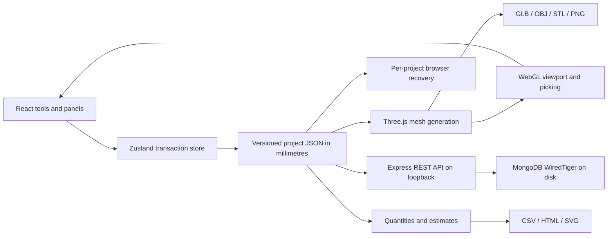

# Architecture and design decisions

## Flow

## Canonical data

`shared/model.js` defines project schema version 1. Geometry is reconstructed from object records rather than serializing the Three.js scene. Every board has a stable ID, name, local dimensions, world centre position, Euler rotation, material, layer, visibility, lock flag and optional group. The coordinate system is X/Y horizontal and Z vertical. Units are millimetres; conversions happen in the properties UI and export adapters.

Box openings are semantic rectangles with left offset, sill, width and height. Mesh generation partitions the remaining wall into rectangular cells; quantities deduct the same rectangle areas and volumes. The operation is bounded to rectangular openings through local Y thickness, not a general boolean engine.

Custom profiles store planar local 2D vertices and an extrusion depth. Mesh regeneration applies requested X/Y dimensions to the profile footprint. Dimensions can store normalized object-local anchors so the endpoint follows resized or moved geometry.

## Editing and history

`commit(label, mutation)` clones the canonical document, applies a change, validates it, then commits one history entry. Failed validation leaves the previous project untouched. Gizmo drags preview transforms in Three.js and commit when the drag ends. Undo/redo restores complete document snapshots; up to 80 prior operations are retained in memory. Browser recovery is updated after committed changes and history navigation.

Assemblies use a flat group relation. Selecting an assembly resolves its member IDs. A temporary transform pivot computes a world matrix delta for the selected objects. Arbitrary nested group transforms and general shearing are outside this version.

## Persistence

Express runs on loopback port 3001. Project saving uses MongoDB replacement upserts keyed by project ID. Named versions copy the full document into a separate collection. Restore returns that document to the UI and creates an undoable local operation.

MongoDB is launched with an explicit persistent database path and `wiredTiger`. Shutdown explicitly disables binary-manager data-directory cleanup. The local binary manager avoids requiring a separately installed Windows service. `.env` can point to a separately administered MongoDB deployment.

The browser keeps one active recovery and a per-project recovery index. These are fallback copies; the API remains the shared project list across local browser origins. Portable JSON is the full-fidelity exchange format.

## API

| Route                                     | Meaning                                  |
| ----------------------------------------- | ---------------------------------------- |
| `GET /api/health`                         | Database readiness                       |
| `GET /api/materials`                      | Preset material catalogue                |
| `GET /api/projects`                       | Saved project metadata                   |
| `GET /api/projects/:id`                   | Complete editable project                |
| `PUT /api/projects/:id`                   | Validate and save project                |
| `DELETE /api/projects/:id`                | Delete saved project and its checkpoints |
| `GET /api/projects/:id/versions`          | List checkpoints                         |
| `POST /api/projects/:id/versions`         | Snapshot the saved project               |
| `GET /api/projects/:id/versions/:version` | Read checkpoint document                 |

The server limits JSON bodies, validates project data, rejects unexpected browser origins, and does not listen on a public interface. This is deliberately a single-user local application, not a multi-tenant service.

## Extending the product

Add an exact solid/topology kernel before implementing unrestricted booleans, topology editing or robust manufacturing solids. Add semantic building objects and constraints before claiming BIM, automatic room schedules or construction documentation. Introduce authenticated services, conflict resolution and migrations before multi-user collaboration. Integrate the existing cut-list engine against stable board IDs, dimensions, material identity and transforms; the current estimate is an independent planning calculation, not a replacement for the user's existing logic.
